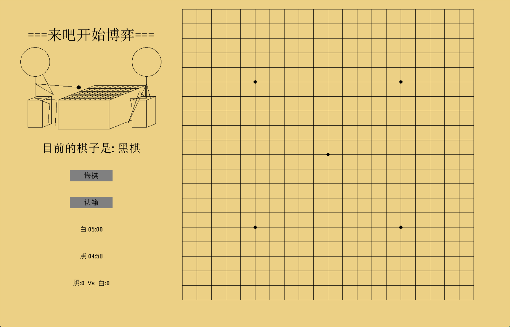

# Tictactoe 五子棋游戏



基于C++与EasyX图形库开发的双人对战五子棋游戏，支持悔棋、倒计时、胜负判定与得分统计功能。

## 🎮 功能特性  

• **双人对战**：支持本地双人轮流对战  
• **智能判定**：自动检测五连棋形胜负  
• **时间管理**：双倒计时系统（默认5分钟/方）  
• **操作回溯**：一键悔棋功能（仅撤回一步）  
• **胜负选择**：即时认输快速结束对局  
• **数据统计**：实时比分记录与显示 
• **界面交互**：可视化棋盘与操作按钮  
• **规则特性**：5枚以上的棋子算爆棋不赢
## 🛠️ 技术栈  

• C++11 标准  
• EasyX 图形库（Windows平台）  
• Makefile 构建系统  
• Win32 API 时间管理  

## 📥 快速开始

### 从源代码构建

**系统要求**：  
• Windows 10/11  
• MinGW-w64 (g++ 8.1+)  
• [EasyX 2022](https://easyx.cn)  

**构建步骤**：
```bash
# 克隆仓库
git clone https://github.com/AbyssFerry/cpp-tictactoe.git
cd tictactoe
./build/Tictactoe.exe
```

### 使用预编译版本

1. 前往 [Releases 页面](https://github.com/AbyssFerry/tictactoe/releases) 下载最新版
2. 解压后直接运行 `Tictactoe.exe`
3. 确保 `res` 文件夹与可执行文件同级

## 🕹️ 操作指南

| 操作                | 功能说明               |
|---------------------|-----------------------|
| 鼠标左键点击棋盘    | 在最近交叉点落子       |
| 点击「悔棋」按钮    | 撤销上一步操作         |
| 点击「认输」按钮    | 立即结束当前对局       |
| 倒计时归零          | 判当前操作方负         |
| 棋盘填满无胜负      | 自动判定平局           |

## 📁 项目结构

```bash
cpp-tictactoe/
├── res/            # 资源文件（字体/音效）
├── build/          # 构建输出目录
├── include/        # 依赖头文件
│   └── easyx.h
├── lib/            # 静态链接库
│   └── libeasyx.a
├── src/            # 源代码
│   └── main.cpp    # 游戏主逻辑
└── Makefile        # 构建配置
```

## 👥 贡献者

• **AbyssFerry** - 项目开发者  
  [](https://github.com/AbyssFerry)  
• **Uwx9** - 编译打包  
  [](https://github.com/Uwx9)  